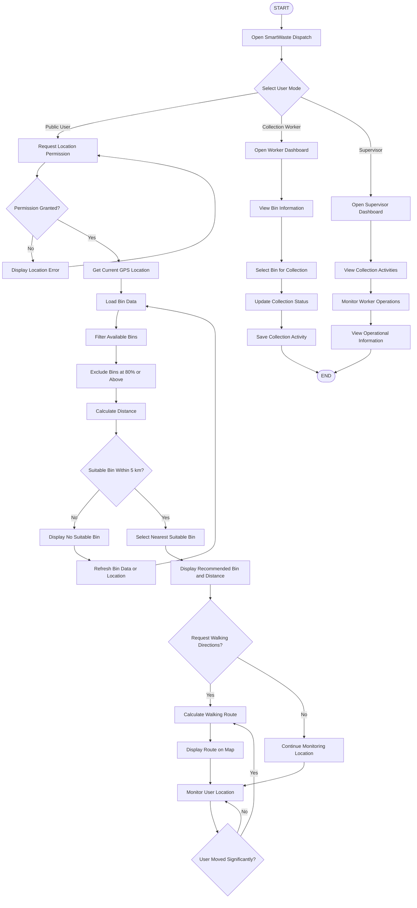

# SmartWaste Dispatch – Overall System Flowchart

```mermaid
flowchart TD
    A([START]) --> B[Open SmartWaste Dispatch]
    B --> C{Select User Mode}

    C -->|Public User| D[Request Location Permission]
    D --> E{Permission Granted?}
    E -->|No| F[Display Location Error]
    F --> D
    E -->|Yes| G[Get Current GPS Location]
    G --> H[Load Bin Data]
    H --> I[Filter Available Bins]
    I --> J[Exclude Bins at 80% or Above]
    J --> K[Calculate Distance]
    K --> L{Suitable Bin Within 5 km?}
    L -->|No| M[Display No Suitable Bin]
    M --> N[Refresh Bin Data or Location]
    N --> H
    L -->|Yes| O[Select Nearest Suitable Bin]
    O --> P[Display Recommended Bin and Distance]
    P --> Q{Request Walking Directions?}
    Q -->|Yes| R[Calculate Walking Route]
    R --> S[Display Route on Map]
    S --> T[Monitor User Location]
    T --> U{User Moved Significantly?}
    U -->|Yes| R
    U -->|No| T
    Q -->|No| V[Continue Monitoring Location]
    V --> T

    C -->|Collection Worker| W[Open Worker Dashboard]
    W --> X[View Bin Information]
    X --> Y[Select Bin for Collection]
    Y --> Z[Update Collection Status]
    Z --> AA[Save Collection Activity]
    AA --> AB([END])

    C -->|Supervisor| AC[Open Supervisor Dashboard]
    AC --> AD[View Collection Activities]
    AD --> AE[Monitor Worker Operations]
    AE --> AF[View Operational Information]
    AF --> AB
```
